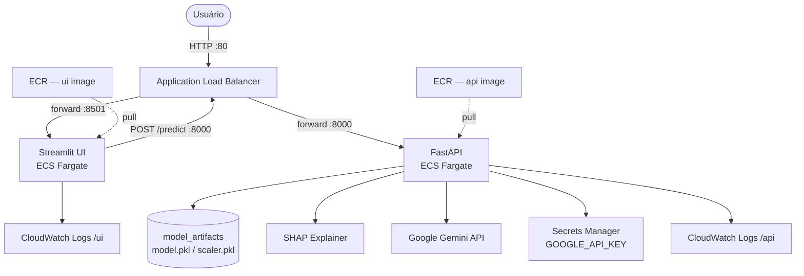

# Sistema de Predição de Risco de AVC com IA Generativa

> Tech Challenge Fase 1 — FIAP Especialização em Inteligência Artificial
> **Autor:** Gabriel Francisco Gonsalves Teixeira — RM368786

Sistema de apoio à decisão médica para triagem de risco de Acidente Vascular Cerebral (AVC), combinando Machine Learning otimizado por Algoritmo Genético, interpretabilidade via SHAP e laudos clínicos gerados automaticamente pelo Gemini 3 Flash.

---

## Visão Geral

O sistema recebe dados clínicos de um paciente e entrega:

1. **Predição de risco** (ALTO / BAIXO) com probabilidade estimada
2. **Explicação SHAP** dos 5 fatores mais relevantes para aquela predição
3. **Laudo clínico em linguagem natural** gerado pelo Gemini, com perfil de risco, fatores determinantes, recomendações e aviso legal

A solução é exposta via **FastAPI** (backend) e **Streamlit** (interface web), prontos para uso local ou implantação em nuvem.

---

## Arquitetura



### Arquitetura Local (desenvolvimento)

### Pipeline de Predição

```
Dados do paciente (raw)
        │
        ▼
  One-Hot Encoding        ← mesmo esquema do treino (drop_first=True)
        │
        ▼
  StandardScaler          ← scaler salvo do treino
        │
        ▼
  Modelo ML (predict)     ← melhor modelo selecionado pelo GA
        │
        ▼
  SHAP Explainer          ← Tree / Linear / Kernel dependendo do modelo
        │
        ▼
  Gemini 3 Flash          ← prompt com dados + SHAP → laudo estruturado
        │
        ▼
  Resposta JSON / UI
```

---

## Machine Learning

### Modelos treinados

| Modelo | Otimização |
|---|---|
| Logistic Regression | GASearchCV (Algoritmo Genético) |
| Decision Tree | GASearchCV |
| K-Nearest Neighbors | GASearchCV |
| Random Forest | GASearchCV |
| SVM | GASearchCV |

O melhor modelo (por F1-Score + Recall no conjunto de teste) é selecionado automaticamente e exportado para uso na API.

### Algoritmo Genético (sklearn-genetic-opt)

Três experimentos com configurações distintas são executados e comparados contra o baseline GridSearchCV:

| | Exp-1 Conservador | Exp-2 Balanceado | Exp-3 Exploratório |
|---|---|---|---|
| `population_size` | 4 | 6 | 8 |
| `generations` | 4 | 6 | 8 |
| `mutation_probability` | 0.10 | 0.15 | 0.25 |
| `crossover_probability` | 0.80 | 0.80 | 0.70 |

Fitness: **F1-Score** em StratifiedKFold 3-fold (escolha deliberada para hardware com recursos limitados).

### Dataset

- **Arquivo:** `data/healthcare-dataset-stroke-data.csv`
- **Registros:** 5.110 casos clínicos
- **Features:** idade, sexo, hipertensão, cardiopatia, estado civil, tipo de trabalho, tipo de residência, glicose média, IMC, tabagismo
- **Target:** `stroke` (0 = sem AVC, 1 = com AVC)
- **Desbalanceamento:** ~5% positivos — tratado com SMOTE no treino

---

## Estrutura do Projeto

```
tech-chalenge-fase1/
├── main.ipynb              # Notebook completo: EDA → GA → SHAP → Gemini
├── api.py                  # Backend FastAPI
├── streamlit_app.py        # Interface Streamlit
├── Dockerfile              # Imagem multi-stage (api + ui)
├── docker-compose.yml      # Sobe API + UI com um único comando
├── .env                    # Variáveis de ambiente (API key)
├── requirements.txt        # Dependências
├── terraform/
│   ├── main.tf             # Infraestrutura AWS (ECS, ALB, Secrets Manager)
│   ├── variables.tf        # Variáveis Terraform
│   └── outputs.tf          # URLs de saída
├── data/
│   └── healthcare-dataset-stroke-data.csv
└── model_artifacts/        # Gerado ao executar o notebook
    ├── model.pkl
    ├── scaler.pkl
    ├── feature_columns.pkl
    ├── X_train_sample.pkl
    └── model_name.txt
```

---

## Execução com Docker

Sobe API + interface com um único comando (requer `model_artifacts/` gerado pelo notebook):

```bash
docker compose up --build
```

| Serviço | URL |
|---|---|
| Interface Streamlit | http://localhost:8501 |
| FastAPI | http://localhost:8000 |
| Swagger | http://localhost:8000/docs |

Para encerrar: `docker compose down`

---

## Implantação na Nuvem (AWS ECS Fargate)

O diretório `terraform/` contém toda a infraestrutura necessária para implantar o sistema na AWS usando ECS Fargate + ALB.

### Pré-requisitos

- [Terraform](https://developer.hashicorp.com/terraform/install) ≥ 1.5
- [AWS CLI](https://docs.aws.amazon.com/cli/latest/userguide/install-cliv2.html) configurado (`aws configure`)
- Docker instalado localmente

### Passo a passo

**1. Construa e publique as imagens no ECR**

```bash
# Substitua <ACCOUNT_ID> e <REGION> pelos seus valores
ACCOUNT=<ACCOUNT_ID>
REGION=us-east-1

aws ecr create-repository --repository-name avc-predictor-api --region $REGION
aws ecr create-repository --repository-name avc-predictor-ui  --region $REGION

aws ecr get-login-password --region $REGION \
  | docker login --username AWS --password-stdin $ACCOUNT.dkr.ecr.$REGION.amazonaws.com

# Execute o notebook antes para gerar model_artifacts/
docker build --target api -t $ACCOUNT.dkr.ecr.$REGION.amazonaws.com/avc-predictor-api:latest .
docker build --target ui  -t $ACCOUNT.dkr.ecr.$REGION.amazonaws.com/avc-predictor-ui:latest  .

docker push $ACCOUNT.dkr.ecr.$REGION.amazonaws.com/avc-predictor-api:latest
docker push $ACCOUNT.dkr.ecr.$REGION.amazonaws.com/avc-predictor-ui:latest
```

**2. Provisione a infraestrutura**

```bash
cd terraform

terraform init

terraform apply \
  -var="api_image=$ACCOUNT.dkr.ecr.$REGION.amazonaws.com/avc-predictor-api:latest" \
  -var="ui_image=$ACCOUNT.dkr.ecr.$REGION.amazonaws.com/avc-predictor-ui:latest" \
  -var="google_api_key=<SUA_CHAVE_GEMINI>"
```

Ao final, o Terraform exibe as URLs de acesso:

```
ui_url      = "http://<alb-dns>"
api_url     = "http://<alb-dns>:8000"
api_docs_url= "http://<alb-dns>:8000/docs"
```

**3. Destruir os recursos**

```bash
terraform destroy
```

---

## Instalação e Execução

### Pré-requisitos

- Python 3.11+
- Chave de API Google Gemini (AI Studio)

### 1. Clone e configure o ambiente

```bash
git clone <url-do-repositório>
cd tech-chalenge-fase1

python3 -m venv .venv
source .venv/bin/activate        # Windows: .venv\Scripts\activate

pip install -r requirements.txt
```

### 2. Configure a chave de API

Edite o arquivo `.env` na raiz do projeto:

```env
GOOGLE_API_KEY=sua_chave_aqui
GEMINI_MODEL=models/gemini-3-flash-preview
```

### 3. Execute o notebook para treinar e exportar o modelo

```bash
jupyter nbconvert --to notebook --execute \
  --ExecutePreprocessor.kernel_name=python3 \
  --ExecutePreprocessor.timeout=600 \
  main.ipynb --output main.ipynb
```

Ou abra manualmente no Jupyter e execute todas as células. Ao final, a pasta `model_artifacts/` será criada automaticamente.

### 4. Inicie a API (terminal 1)

```bash
uvicorn api:app --reload --port 8000
```

### 5. Inicie a interface Streamlit (terminal 2)

```bash
streamlit run streamlit_app.py --server.port 8501
```

Acesse **http://localhost:8501** no navegador.

---

## API Reference

Base URL: `http://localhost:8000`

### `GET /health`

Verifica se o serviço está no ar e qual modelo está carregado.

**Resposta:**
```json
{
  "status": "ok",
  "model": "Logistic Regression"
}
```

### `POST /predict`

Realiza a predição de risco de AVC para um paciente.

**Body (JSON):**

| Campo | Tipo | Exemplo | Descrição |
|---|---|---|---|
| `age` | float | `67` | Idade em anos |
| `hypertension` | int (0/1) | `0` | Possui hipertensão |
| `heart_disease` | int (0/1) | `1` | Possui cardiopatia |
| `avg_glucose_level` | float | `228.69` | Glicose média (mg/dL) |
| `bmi` | float | `36.6` | Índice de Massa Corporal |
| `gender` | string | `"Male"` | `Male`, `Female`, `Other` |
| `ever_married` | string | `"Yes"` | `Yes`, `No` |
| `work_type` | string | `"Private"` | `Private`, `Self-employed`, `Govt_job`, `children`, `Never_worked` |
| `Residence_type` | string | `"Urban"` | `Urban`, `Rural` |
| `smoking_status` | string | `"formerly smoked"` | `never smoked`, `formerly smoked`, `smokes`, `Unknown` |

**Resposta:**
```json
{
  "predicao": 1,
  "risco": "ALTO",
  "probabilidade": 0.8341,
  "modelo_utilizado": "Logistic Regression",
  "shap_top5": {
    "age": 1.8157,
    "avg_glucose_level": 0.9203,
    "hypertension": 0.6411,
    "bmi": 0.3120,
    "heart_disease": 0.2984
  },
  "relatorio_clinico": "**Perfil de risco**\n..."
}
```

**Exemplo curl:**
```bash
curl -X POST http://localhost:8000/predict \
  -H "Content-Type: application/json" \
  -d '{
    "age": 67, "hypertension": 0, "heart_disease": 1,
    "avg_glucose_level": 228.69, "bmi": 36.6,
    "gender": "Male", "ever_married": "Yes",
    "work_type": "Private", "Residence_type": "Urban",
    "smoking_status": "formerly smoked"
  }'
```

A documentação interativa completa (Swagger) está disponível em **http://localhost:8000/docs**.

---

## IA Generativa — Prompt Engineering

O laudo clínico é gerado com a estratégia **few-shot**, que demonstra empiricamente melhor qualidade nos testes realizados no notebook. As três estratégias implementadas são:

| Estratégia | Descrição |
|---|---|
| Zero-Shot | Instrução direta sem exemplos |
| Chain-of-Thought | Raciocínio passo a passo (4 etapas) |
| Few-Shot | Com exemplo demonstrativo de caso similar |

A qualidade de cada interpretação é avaliada automaticamente por uma rubrica heurística de **0 a 7 pontos**, verificando: presença das 4 seções obrigatórias, contagem de palavras (150–450), uso de terminologia médica e coerência com a predição.

---

## Observações

- Esta ferramenta é de **apoio à decisão médica** e não substitui a avaliação de um profissional de saúde habilitado
- Os modelos foram treinados em dataset público e requerem validação clínica antes de uso em produção
- O desempenho do Gemini depende de conectividade com a API Google e cota disponível

---

## Licença

Projeto acadêmico desenvolvido para o Tech Challenge FIAP — Especialização em Inteligência Artificial.
